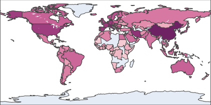
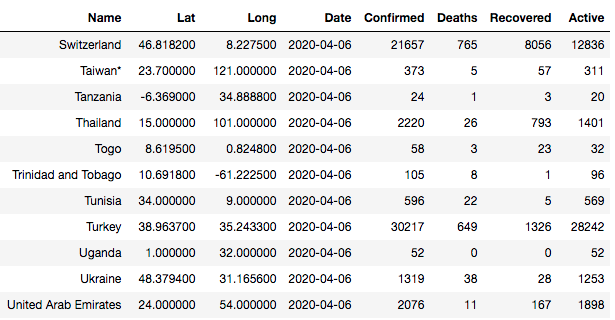
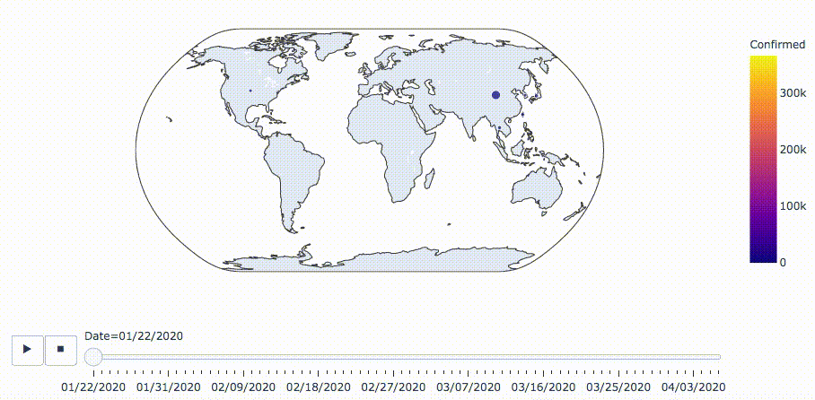

# Visualizing the Spread of COVID-19
This project seeks to improve visualizion methods showing the spread of COVID-19. 

Still images and numerical tables do not effectively show rate of transmission or regional information.

It is more effective to use dynamic geoscatter plots and additional advanced visualization techniques.

